## {width="6.470197944006999in" height="0.11458333333333333in"} 

{width="6.463542213473316in" height="4.309027777777778in"}

DOTNET CORE

From zero to hero

**─**

HAMOU Amine

GLSID

ENSET

Mohammedia

# Introduction au Framework DOTNET

Le Framework .NET est intrinsèquement lié à Windows depuis ses débuts en 2002 : cela est un de ses composants pré-installé (mais pas forcément activé par défaut). Les applications .Net compte sur sa présence dans l'OS et c'est Microsoft, via Windows Update, qui procède à sa mise à jour.

Cela a donc pour implication que toutes les applications du PC partagent la même version du Framework et qu'une application .Net ne peut être exécutée que sur Windows. Cela est valable à la fois pour les applications bureau, les applications Windows Store mais aussi les applications Web.

De plus, le Framework est un produit propriétaire que seul Microsoft peut modifier et distribuer.

Il existe plusieurs versions différentes de ce Framework pouvant cibler la même architecture (.net 3.5, 4.0, etc.) ou des architectures complètement différentes (.Net compact Framework, etc.). Certains éditeurs proposent aussi des produits similaires tels que Mono permettant d'utiliser .Net sur d'autres plateformes (iOS, Linux, Android, etc.). La tendance qui émerge est ainsi d'avoir de plus en plus de versions différentes, nécessaires, à faire évoluer et à maintenir....

{width="6.5in" height="2.875in"}

Pour résoudre ce problème Microsoft a créé une révolution (et je pèse mes mots) en proposant .Net Core !

# C'est quoi le DOTNET CORE ?

Il s'agit d'une transformation complète du Framework .Net sous la forme de composants modulaires, utilisables à la demande, cross plateforme et ... open-source !

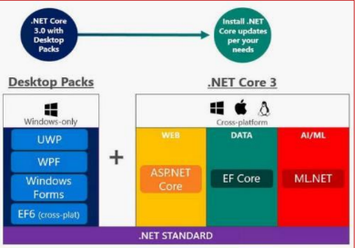{width="4.0625in" height="2.84375in"}

Il est découpé en 2 parties complémentaires :

-   ***CoreFx*** : l'implémentation concrète de .Net Core sous la forme de plusieurs assemblies (DLL)

-   ***CoreCLR*** : correspond au moteur d'exécution de .Net Core ( garbage collector, compilateur JIT, types de base .Net)

Le Framework .Net devient donc une norme (ECMA 335) et Microsoft en propose déjà une implémentation sur plusieurs plateformes (Windows, Linux et Mac).

# Caractéristiques

Les caractéristiques principales de ce Framework sont:

-   **Modularité** : n'utilisez que ce dont vous avez besoin.

-   **Moderne** : il s'agit de la dernière version de .NET avec tout ce que l'on aime -- async, Linq, generics, etc.

-   **À jour** : le déploiement via Nuget permet des mises à jour plus fréquentes et lorsque vous (le développeur) le décidez.

-   **Cross-plateformes** : en utilisant .Net Core vous vous assurez que votre code est (ou sera) portable aisément sur d'autres plateformes.

-   **Performance** : les gains annoncés et constatés sont au rendez-vous.

# Installation DOTNET CORE

Premièrement on doit télécharger le sdk via le lien suivant:

dotnet.microsoft.com/en-us/download/dotnet/3.1

Ensuite on lance l'installation et on suit l'assistant de l'installation jusqu'à la fin.

pour s\'assurer de la bonne installation du sdk on ouvre une ligne de commande et on tape la commande **dotnet** , si tout est bon on aura un affichage comme le suivant:

{width="6.375in" height="3.21875in"}

Par la suite nous allons enchaîner vers la création d'une application web basé sur DOTNET CORE.

# Application DOTNET CORE de type Console

Pour créer une application console, il suffit de taper la commande suivante:

**dotnet new console -o TestConsoleApp**

Cette commande créera une application console dans un dossier nommé *TestConsoleApp*

{width="6.5in" height="1.1805555555555556in"}

voici le contenu du dossier:

{width="6.5in" height="2.3333333333333335in"}

Pour lancer l'application on exécute la commande **dotnet run**

{width="6.5in" height="0.7638888888888888in"}

# Application DOTNET CORE de type Web

Pour créer une application web on exécute une commande similaire à celle mentionnée avant : **dotnet new web -o FirstWebApp**

Si en plus on veut spécifier le modèle à utiliser lors de la création du projet on peut ajouter l'option: **-f\|\--framework \<FRAMEWORK>**

Cette option spécifie le Framework à cibler. Option disponible à partir du kit SDK .NET Core 3.0.

Le tableau suivant répertorie les valeurs par défaut en fonction du numéro de version du kit de développement logiciel (SDK) que vous utilisez :

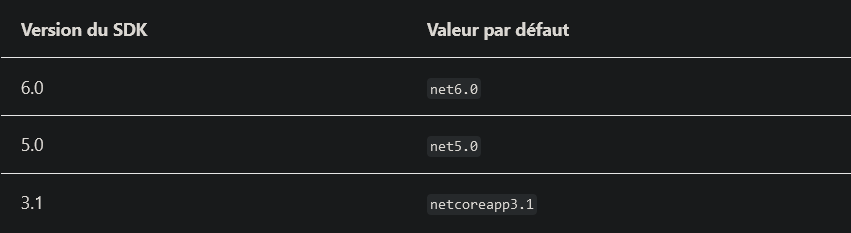{width="6.5in" height="1.7777777777777777in"}

donc la forme finale de la commande à exécuter est la suivante:

{width="6.5in" height="1.4166666666666667in"}

la structure du projet obtenu est la suivante:

{width="6.5in" height="2.6944444444444446in"}

on est intéressé à ces deux classes:

{width="2.59375in" height="3.4270833333333335in"}

On commence par la classe Program:

{width="6.5in" height="4.152777777777778in"}

La classe Program.cs est responsable de démarrer le conteneur web *iis express,* celui demarre ASP.NET CORE qui execute une classe qui s'appelle Startup.cs

{width="4.135416666666667in" height="2.1041666666666665in"}

On constate que l'application est configurée au niveau de la classe Startup,

dans la méthode **ConfigureServices()** on spécifie les services qu'on souhaite utiliser dans notre application. c'est dans cette méthode qu'on note les services à injecter dans l'application.

Dans la méthode **Configure()** on configure les services mentionnés préalablement.

et c'est ça le point fort du nouveau framework: on ne démarre que les service dont on a besoin, au contraire de l'ancien framework qui démarre beaucoup du service pour n'importe quelle application sans tenir compte de est ce que l'app est vraiment a besoin des services démarré dans l\'arrière plan, qui a rendu le démarrage trés lourd.

{width="6.5in" height="4.027777777777778in"}

Pour le moment la méthode ConfigureServices() est vide.

Pour la deuxième méthode, dedans on spécifie le comportement désiré dans l\'environnement de développement (lever les exceptions).

Par la suite, on spécifie le système de routage. Pour le moment on ajoute une seule route qui pointe sur la racine de l'api avec le message *"GLSID AmineH says Hi"*

on lance notre application :

{width="6.5in" height="2.1944444444444446in"}

l'application est en ligne sur le port 5000:

{width="5.348958880139983in" height="1.2131660104986877in"}

Par la suite nous allons essayer de mettre en place l'architecture ci-dessous:

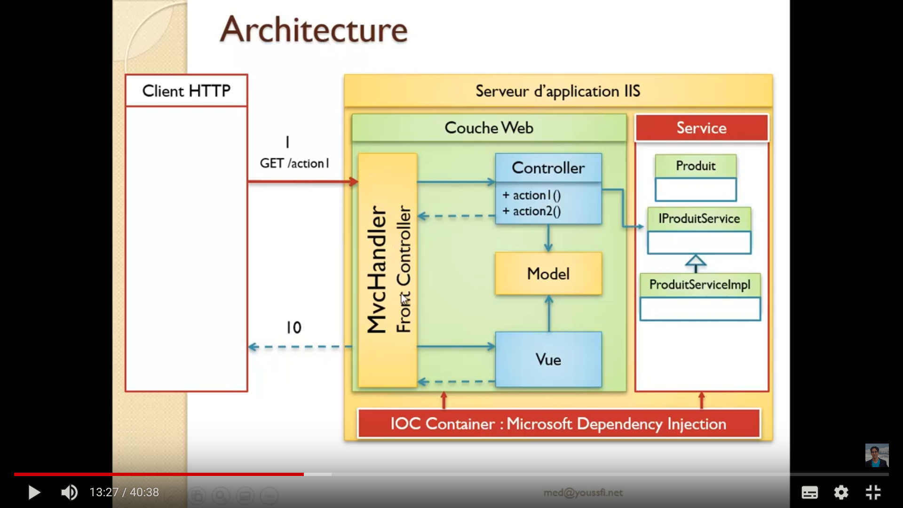{width="4.178172572178478in" height="2.713542213473316in"}

La première chose est pour qu'on puisse utiliser les fichiers statiques(css, images, ...) il faut ajouter la ligne ***app.UseStaticFiles()*** dans la méthode configure:

{width="6.5in" height="2.361111111111111in"}

et ajouter un dossier qui s'appelle ***wwwroot*** au projet dedans on ajoute nos fichiers statiques

{width="2.53125in" height="3.40625in"}

et puisqu'on envisage de travailler sur un projet de type MVC, on ajoutera 3 autres dossiers portant les noms ***Controllers, Model, Views.***

Dans la méthode **ConfigureServices()** on spécifie qu'on va travailler avec des contrôleurs avec des view

{width="6.5in" height="1.9722222222222223in"}

et on définit un pattern générale pour le routage des contrôleurs avec les vues dans la méthode **configure()** :

{width="6.5in" height="4.611111111111111in"}

Cela est très utile, au lieu de spécifier chaque route, on utilisera le routage basé sur les conventions qu'on crée nous même, cela s'appelle le ***"convention-based routing"*** et il s'agit de regrouper et évaluer les routes par rapport aux urls pour trouvers des correspondances (matches en anglais). Si une correspondance est trouvée, la demande est redirigée vers le contrôleur et l'action adéquate.

Maintenant on va créer un contrôleur dans le dossier Controllers:

{width="6.322916666666667in" height="3.6979166666666665in"}

Si on suit les convention de framework dotnet on n'a pas besoin de spécifier beaucoup d'information sur les vues liées à ce contrôleur, le framework infère ces information depuis la structure de contrôleur, par exemple ce contrôleur nommé Test est déclenché par une demande vers le endpoint "/Test/Index" et renvoie une vue avec le même nom de la méthode c'est à dire il renvoi une vue qui s'appelle ***Index.cshtml.*** tout ce qu'il manque est de créer cette vue.

{width="6.5in" height="2.0416666666666665in"}

Les vues relatives au contrôleur Test devons être dans une dossier portant le nom Test dans le dossier Views:

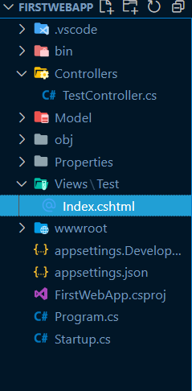{width="2.4895833333333335in" height="5.0625in"}

{width="6.5in" height="1.0694444444444444in"}

Si de plus nous voulons transmettre des donnée du contrôleur vers la vue on les fournit comme des arguments de la méthode action , comme ci-dessus:

{width="6.5in" height="3.4305555555555554in"}

et dans la vue nous allons les récupérer et les afficher selon notre besoin, notez qu'il est obligatoire de spécifier le type de notre modèle:

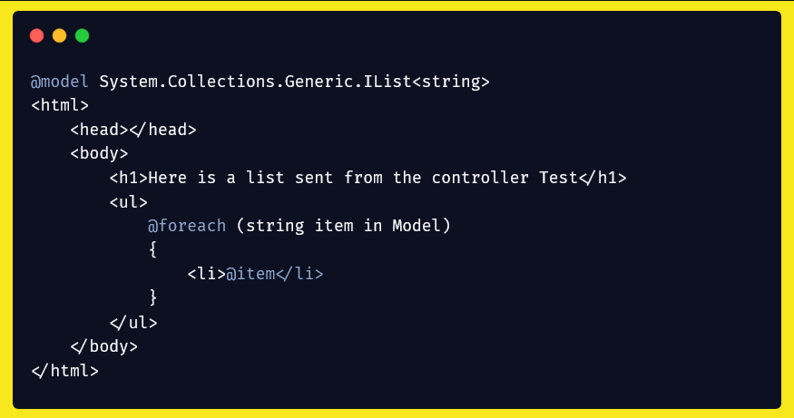{width="6.5in" height="3.4305555555555554in"}

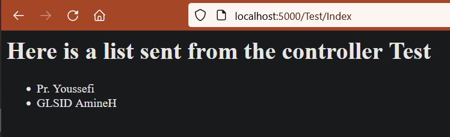{width="6.5in" height="1.9861111111111112in"}

A part la manière de fournir le modèle en paramètre de méthode illustré ci-dessus, on peut utiliser deux objets qu'on obtient depuis la classé étendu ***Controller***, ces deux objets s\'appellent ***ViewData*** et ***ViewBag.*** il suffit d'attacher notre attribut à un de ces objet par exemple:

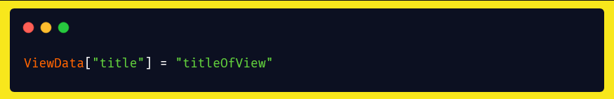{width="6.5in" height="1.0416666666666667in"}

ou

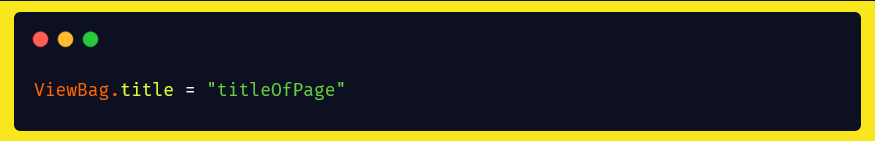{width="6.5in" height="1.0416666666666667in"}

et par la suite exploiter cet objet dans la vue:

{width="6.5in" height="2.638888888888889in"}

Maintenant qu'on sait comment afficher des vues, on constate que peut être il y aura des parties de nos vues qui se répètent partout, ça sera mieux de créer un layout dans lequel on injecte les vues désirées. Pour illustrer ce point nous allons créer un header et footer qui doit s'afficher dans n'importe quelle vue.

Premièrement nous allons ajouter Bootstrap à notre application parce que Bootstrap est génial !

On télécharge Bootsrap via [[https://blog.getbootstrap.com/2016/07/25/bootstrap-3-3-7-released/]{.underline}](https://blog.getbootstrap.com/2016/07/25/bootstrap-3-3-7-released/) et on l'extrait. Ce qui nous intéresse c'est le fichier ***bootstrap.min.css.***

Rappelez vous qu'on a dit qu'on va placer nos fichiers statiques dans le dossier ***wwwroot.*** Alors dans ce dossier on crée un dossier qui s'appelle ***css*** et dedans on colle le fichier ***bootstrap.min.css.***

{width="2.5625in" height="5.145833333333333in"}

Maintenant on va créer notre layout qui contient un Header et un Footer:

Dans le dossier Views on crée un dossier qui s'appelle ***shared*** ce dossier contiendra tous les éléments d'agencement (layouts) de notre application, dedans on crée une vue qui s'appelle ***\_layout.cshtml*** c'est dans cette vue qu'on devinera le header et footer de notre application :

{width="2.5in" height="5.729166666666667in"}

Remarquer qu'on a exploiter l'objet ViewData pour définir le titre de la page

Par la suite on a spécifié la structure de la page qu'on veut, rien de spécial, seulement une navbar à l'aide de bootstrap qui joue le rôle du header.

{width="6.5in" height="5.083333333333333in"}

Après le header on a une balise \<section> dedans on utilise la directive ***\@RenderBody,*** pour visualiser une portion de code html qui ne se trouve pas nécessairement dans le même fichier. cela est très puissant, du coup maintenant on peut injecter n'importe quelle vue dans cet endroit où se trouve la directive ***\@RenderBody.***

Mais comment faire ça exactement.

alors on va vers notre vue préalablement créée (***Index.cshtml***) et on lui affecte les changement suivantes:

Il suffit de spécifier le nom du layout concerné dans la vue pour que le moteur de template l'englobe avec le layout spécifié, comme illustré ci-dessous:

{width="6.5in" height="4.236111111111111in"}

Voici le résultat finale :

{width="6.5in" height="2.1666666666666665in"}

Maintenant qu'on a vu comment lier les vues aux contrôleurs, pourquoi pas récapituler tout ce qu'on a fait en créant cette fois une modèle Student (étudiant) au lieu des liste de chaînes de text :

tout d'abord on crée notre modèle dans le dossier Model:

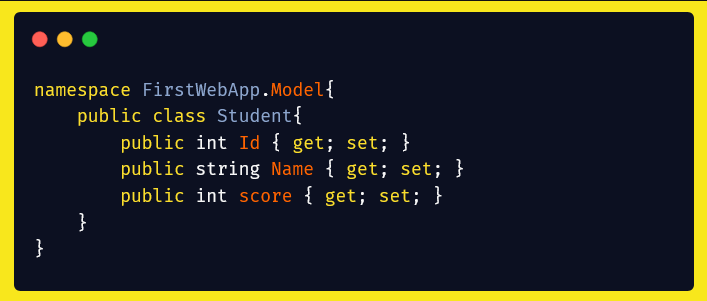{width="6.5in" height="2.763888888888889in"}

Par la suite on ajoute une méthode à notre contrôleur qui gère les requête vers la listes des étudiants :

{width="6.5in" height="2.4305555555555554in"}

Finalement on va ajouter une vue (View) qui visualise la liste des étudiant dans un tableau html:

{width="6.5in" height="1.7083333333333333in"}

C'est très simple, n'est-ce pas!

Avez vous remarquez qu'à chaque vue on importe le layout, y-a-t-il pas une façon plus élégante pour ce faire? oui, il y a .

Dans le dossier **Views** on crée un fichier qui porte le nom **\_ViewsStart.cshtml,** dans ce fichier on colle la ligne responsable de l'import du layout {width="2.4479166666666665in" height="1.25in"}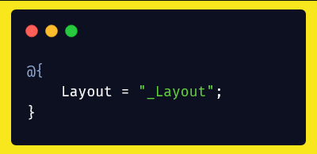{width="2.6093755468066493in" height="1.276586832895888in"}

et on supprime cette ligne depuis les vues (Index.cshtml et List.cshtml). Vous devez avoir le même résultat qu\'en avant.

Nous avons une application fonctionnelle, si seulement on peut persister nos données vers une base de données nous pouvons créer le prochain facebook!

La prochaine partie va présenter un aspect crucial de la programmation d'une application web : l'accès aux données.

## Framework Entity 

Entity est un ORM qui va nous permettre d'accéder à une source de données sans que nous ayons la sensation de travailler avec une base de données. Cela paraît étrange, mais signifie simplement que grâce à cet ORM, nous n'allons plus écrire de requêtes, ni créer de tables, etc., via un système de gestion de base de données mais directement manipuler les données dans notre code C#.

Nous allons choisir *Entity Framework* en tant qu'ORM pour plusieurs raisons :

-   c'est le produit mis en avant par Microsoft, il est régulièrement mis à jour (actuellement : version 6) ;

-   il est bien documenté ;

-   il est parfaitement intégré au reste du framework .NET (validation, exceptions, Linq...) ;

-   il se base sur l'API standard ADO.NET ;

-   il est complet tout en restant suffisamment simple d'utilisation pour le présenter à des débutants.

Pour travailler avec Entity nous devons installer ses dépendance d'abord, pour ce faire il suffit d\'exécuter les commandes suivante dans le dossier du projet DOTNET:

{width="6.5in" height="1.0833333333333333in"}

{width="6.5in" height="1.25in"}

voyons nous comment ça passe:

{width="6.5in" height="1.5138888888888888in"}

{width="6.5in" height="1.7222222222222223in"}

si tout va bien nous allons remarquer l'ajout de ces deux dépendances dans le fichier **FirstWebApp.csproj**

{width="6.5in" height="1.7708333333333333in"}

Par la suite il faut ajouter la service dans la méthode **ConfigureServices()**, en utilisant la ligne **services.AddDbContext\<MyDbContext>()** et en spécifiant le nom de la classe qui gère la base de donnée(dans notre cas c'est class qu'on va créer qui s'appelle **MyDbContext**)

Cette méthode reçoit une expression lambda qui spécifie la nature de la base de données et son nom.

Nous allons utiliser une base de donnée mémoire (InMemory) qui porte le nom **DbStudents**

{width="6.5in" height="2.25in"}

N'oubliez pas de créer la classe MyDbContext dans la racine de projet:

{width="2.4479166666666665in" height="4.479166666666667in"}

Alors pour que cette classe gère le mapping objet relationnel on doit étendre la classe **DbContext,** crée une constructeur qui a comme paramètre un objet de type ***DbContextOptions*** et on le passe vers la classe mère.

de plus on crée une liste de type DbSet dans laquelle on enregistre les objets de type Student

{width="6.5in" height="2.9166666666666665in"}

et voilà, le mapping objet relationnel de notre application est presque fait, il nous reste qu'allez vers la classe Student pour spécifier la clé primaire si cela est nécessaire.

l'annotation \[Key\] informe le framework que cet attribut représente la clé primaire de la table, \[Required\] indique qu'il faut fournir cet attribut pour tout enregistrement, et \[StringLength\] indique la longueur de la chaîne de caractères.

On peut par la suite ajouter une annotation\[Table("nom_de_table")\] au dessous de la déclaration de la classe pour spécifier le nom de la table qui correspond à cette entité, sinon il donne le nom de la classe à la table (dans notre cas, il y aura une table nommé Student dans la base des données)

{width="6.5in" height="3.111111111111111in"}

## Rest Api

Par la suite nous allons enchaîner vers la création d'une api REST pour qu'on puisse consulter et exploiter la base donnée.

Dans la racine du projet nous allons créer un fichier qui porte le nom:

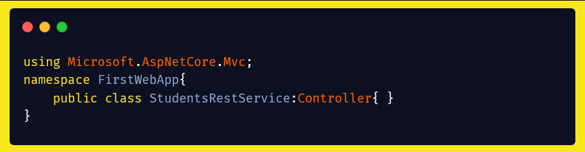{width="6.5in" height="1.6944444444444444in"}

Ce service n'est qu'un contrôleur.

Ce contrôleur devrais avoir l'accès à l'objet responsable sur le mapping objet relationnel de Student, c'est le **MyDbContext**

donc puisque le service est déjà configuré dans la méthode **ConfigureServices()**, il suffit de passer un objet de type MyDbContext dans le constructeur de contrôleur pour que le framework fasse l'injection de dépendance et on peut par la suite l'exploiter sans problèmes.

{width="6.5in" height="4.125in"}

La directive **\[Route("api/students")\]** est utilisée pour spécifier quelle route utiliser pour accéder au contrôleur.

la méthode **list()** renvoie une liste des objets Students à partir de **MyDbContext** qui gère le stockage des objets Students. Cette méthode est décorée par la directive **\[HttpGet\]** pour indiquer que cette méthode est déclenchée par une requête Rest de type GET.

ensuite nous allons écrire une méthode qui implémente la fonctionnalité d'ajouter un étudiant:

cette méthode est déclenché par une requête de type **POST** et elle devrait recevoir un objet **Student** dans le corp (Body) du requete

{width="6.5in" height="2.0972222222222223in"}

Faites attention à toujours appeler le méthode **SaveChanges** sur l'objet **dbServices** après une opération qui effectue un changement sur la base de donnée( ajout, suppression, modification)

En utilisant **Postman**, on va envoyer une requête au serveur qui permet d'enregistrer un nouveau Student dans la base de donnée

{width="6.5in" height="1.5in"}

par la suite nous allons consulter la liste pour afficher les étudiants,

{width="6.5in" height="1.4166666666666667in"}

la prochaine méthode qu'on envisage créer est celle qui cherche et renvoie un objet Student à partir de son Id

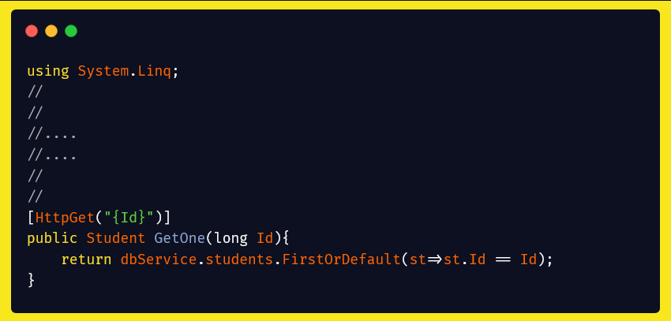{width="6.5in" height="3.111111111111111in"}

Notez que dans la directive **\[Http("{Id}")\]** le paramètre ajouté signifie qu'on anticipe recevoir un Id dans l\' url de la requête, si par la suite le nom de paramètre de la méthode **GetOne(long Id)** a le même nom, le Framework comprend qu'il recevra un paramètre Id dans le url de la requête et c\'est ce paramètre qu'il fournira comme argument de la méthode.

Maintenant qu'on accès à la variable Id depuis url on va l'utiliser pour récupérer l'objet Student qui vérifie la condition définit par l'expression lambda.

notez qu'on doit importer **System.Linq** pour qu'on puisse utiliser la fonction **FirstOrDefault** sur la Collection **students** de **dbService**

et on va créer une méthode pour supprimer un Student à partir de son Id, c'est la même que la précédente, sauf qu'il faut spécifier le type de requête **Http** comme **HttpDelete** et effectuer le traitement convenable

{width="6.5in" height="2.0416666666666665in"}

la dernière est une méthode qui modifie un objet à partir de son Id:

{width="6.5in" height="2.236111111111111in"}

Maintenant on va tester notre api:

d'abord on ajoute quelque étudiants:

{width="6.5in" height="1.2222222222222223in"}

{width="6.5in" height="1.1805555555555556in"}

{width="6.5in" height="1.1666666666666667in"}

Puis on teste la récupération de tous les données:

{width="6.5in" height="2.9444444444444446in"}

et si on essaye de récupérer un seul étudiant à partir de son Id:

{width="6.5in" height="1.4305555555555556in"}

Maintenant on va supprimer l'étudiant qui a l'Id 2

{width="6.5in" height="0.9583333333333334in"}

et on affiche l'ensemble des étudiant une autre fois pour s'assurer du succès de l'opération de suppression:

{width="6.5in" height="2.513888888888889in"}

l'opération est faite avec succès.

Finalement on va essayer de modifier le nom de l'étudiante qui a l'Id 3:

{width="6.5in" height="1.1805555555555556in"}

et on visualise l'ensemble des étudiant encore une fois:

{width="6.5in" height="2.2916666666666665in"}

Excellent!!
